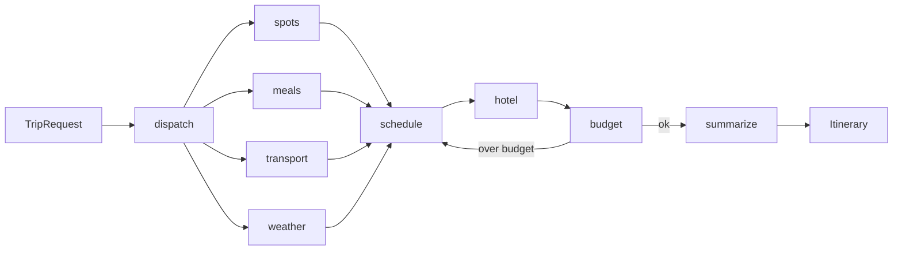

# 智旅云图

面向旅行计划生成的全栈原型：前端收集目的地、日期、偏好、预算和饮食要求，后端通过 LangGraph 风格的多 Agent 编排生成结构化行程，并补充地图、天气、预算、住宿和导出能力。

## 当前架构

后端生成链路已经从“单次 LLM 草稿 + 规则拼装”迁移为分节点编排：



节点职责：

- `dispatch`：标准化目的地、偏好、饮食、交通和天数。
- `spots`：通过高德 POI 优先检索候选景点，工具不可用时用规则候选兜底。
- `meals`：按饮食偏好生成候选餐饮池。
- `transport`：生成市内交通策略。
- `weather`：优先用高德天气，远期或失败时降级为季节气候。
- `schedule`：坐标聚类、分天、最近邻排序、雨天室内优先和餐饮就近分配。
- `hotel`：按每日活动中心点填充住宿。
- `budget`：核算交通、住宿、餐饮、门票和其他费用，超支时触发重排。
- `summarize`：组装最终 `Itinerary`，并把节点 trace 写入 `source_notes`。

> 本版本已移除本地向量检索链路。行程候选来自高德 POI / 天气接口和确定性降级规则，不再需要 ChromaDB、入库脚本或本地攻略 corpus。

## 目录结构

```text
backend/
  app/
    agents/
      graph.py              # 图装配、运行入口、SSE 事件生成
      monitoring.py         # 节点监控装饰器
      state.py              # TripState 和内部候选模型
      algorithms/
        cluster.py          # 地理分天
        routing.py          # 最近邻排序
      nodes/
        dispatch.py
        spot_search.py
        meal_search.py
        transport_search.py
        weather.py
        schedule.py
        hotel.py
        budget_check.py
        summarize.py
    api/
      routes/trip.py        # /trip/generate 和 /trip/generate/stream
    services/
      map_service.py
      weather_service.py
      storage_service.py
      export_service.py
      trip_service.py       # graph 优先、规则兜底的薄入口
frontend/
  src/
    views/
    services/
    types/
```

## API

- `POST /trip/generate`：生成完整结构化行程，返回 `Itinerary`。
- `POST /trip/generate/stream`：SSE 输出节点进度，最后返回完整 `Itinerary`。
- `POST /trip/edit`：编辑已有行程；当前保留规则兜底，后续迁移为编辑子图。
- `POST /trip/save`、`GET /trip`、`GET /trip/{trip_id}`、`DELETE /trip/{trip_id}`：行程持久化。
- `GET /weather/forecast`：天气查询。
- `GET /export/{trip_id}/markdown`、`GET /export/{trip_id}/pdf`：导出。

## 配置

后端读取 `backend/.env`。常用配置：

```env
LLM_PROVIDER=openai_compatible
LLM_API_KEY=your_api_key_here
LLM_MODEL=qwen-max
LLM_BASE_URL=https://dashscope.aliyuncs.com/compatible-mode/v1

AMAP_API_KEY=your_amap_api_key
AMAP_BASE_URL=https://restapi.amap.com/v3
AMAP_DEFAULT_CITY=
ENABLE_AMAP_ENRICHMENT=true

REDIS_ENABLED=false
REDIS_URL=redis://127.0.0.1:6379/0

USE_LANGGRAPH=true
TRIP_MAX_REPLAN=2
TRIP_SPOT_MIN_CANDIDATES=8
TRIP_SPOT_MAX_SEARCH_ROUNDS=2
TRIP_ENABLE_WEB_SEARCH=false
WEATHER_FORECAST_MAX_DAYS=4
```

## 本地运行

后端：

```bash
cd backend
pip install -r requirements.txt
uvicorn app.api.main:app --reload
```

前端：

```bash
cd frontend
npm install
npm run dev
```

Docker：

```bash
docker compose up --build
```

## 验证

当前环境中的 `pytest` 可能在 Anaconda 的 `_pytest/capture.py` 初始化阶段触发 native 段错误；如果遇到 `exit 139`，可先用编译和 smoke 脚本验证核心路径：

```bash
python -m compileall -q backend/app backend/tests backend/scripts
python backend/scripts/test_trip_graph_real.py
```

后端新增的关键测试覆盖：

- `backend/tests/test_agents_algorithms.py`
- `backend/tests/test_agents_graph.py`
- `backend/tests/test_agents_nodes.py`
- `backend/tests/test_no_rag_runtime.py`
