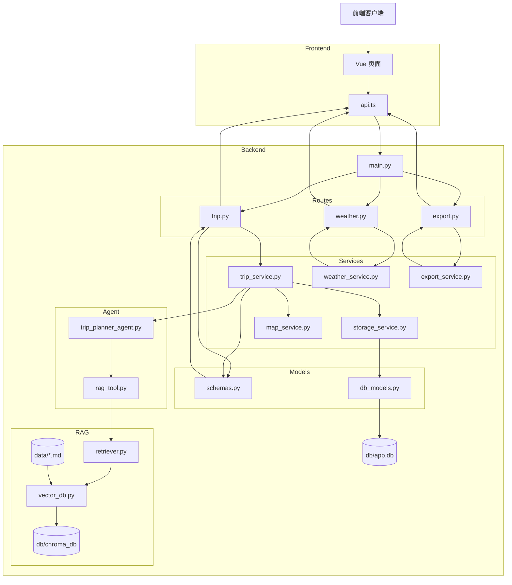

# 🗺️ 智旅云图

> 融合大模型、RAG、本地攻略与高德地图能力的智能旅行规划系统

智旅云图是一个面向中文旅行场景的 AI 旅行规划项目。用户输入目的地、日期、预算、人数和偏好后，系统会自动生成结构化旅行方案，并进一步补充地图点位、天气信息、预算拆分、景点图片与可导出的旅行文档。

相比只输出一段文本的 LLM Demo，这个项目更强调完整链路落地：从 **行程生成、攻略检索、地图信息补全、天气补充，到历史管理与文档导出**，尽量把 AI 能力组织成一个可交互、可保存、可展示的产品原型。

## 📝 最近更新

- `2026-04-29`：扩充 RAG 知识库至 5 个目的地（大理/成都/西安/厦门/三亚），评估样例集扩充至 15 条，完成规则级 Rerank 多层降权与 Query Rewrite 目的地过滤。
- `2026-04-25`：完成第一轮 RAG 在线阶段优化，已接入轻量化 Query Rewrite、轻量 Rerank 与检索调试脚本。
- `2026-04-15`：新增 Redis 缓存层，已覆盖天气查询、地图查询与 RAG 检索结果缓存。

更多更新见：[CHANGELOG.md](./CHANGELOG.md)


---

## 📸 效果展示

### 规划页


### 行程生成结果页


### 保存与历史管理


### PDF 导出效果


---

## ✨ 项目亮点

- 🧠 **LLM 行程生成**：基于 LangChain + DashScope 调用 `qwen-max` 生成结构化旅行计划
- 📚 **RAG 攻略增强**：使用本地 Markdown 攻略 + Chroma 向量检索，为生成结果补充目的地上下文
- 🧭 **RAG 在线优化**：规则级 Query Rewrite（含目的地过滤）+ 多层 Rerank 降权（行程/简介/目的地不匹配），消除跨目的地污染
- 🗺️ **高德地图接入**：补充景点地址、经纬度、POI ID、路线距离、耗时和景点图片
- 🌦️ **天气感知提示**：前端展示天气预报，并根据雨天/阴天自动修正旅行提示
- ⚡ **Redis 缓存层**：覆盖天气、地图与 RAG 检索缓存，减少重复外部调用开销
- 💰 **预算拆分**：按交通、住宿、餐饮、门票、其他费用拆分，并支持按天展示
- 🪄 **智能编辑**：支持用户用自然语言调整某一天行程
- 🗂️ **历史管理**：支持保存、查看、打开、删除历史 itinerary
- 📄 **文档导出**：支持 Markdown 和中文 PDF 导出，导出前自动同步当前页面数据
- 🖥️ **前端可视化**：提供规划页、结果页和历史页，完成核心业务闭环展示

---

## 🏗️ 技术架构

### 技术栈

- 后端：FastAPI + Pydantic + SQLAlchemy
- LLM：LangChain + DashScope (`qwen-max`)
- 向量库：ChromaDB
- 缓存：Redis
- 外部服务：HTTPX + 高德地图 Web 服务 + 高德 JavaScript API
- 前端：Vue 3 + Vite
- 数据库：SQLite

### 核心架构分层

| 层级 | 关键文件 | 职责 |
| :--- | :--- | :--- |
| 前端 | `frontend/src/views/*.vue` | 规划页、结果页、历史页展示与交互 |
| 接口层 | `backend/app/api/routes/` | trip、export、weather 路由 |
| 服务层 | `backend/app/services/` | 行程编排、地图 enrich、天气、缓存、导出、存储 |
| Agent 层 | `backend/app/agents/` | LLM 行程生成 + RAG Query Rewrite |
| RAG 层 | `backend/app/rag/` | 向量入库、检索、Rerank |
| 数据层 | `backend/data/` | 本地 Markdown 攻略文档 |

### 系统数据流



数据流路径：前端收集用户输入 → 后端调用 LLM + RAG 生成结构化行程 → 地图服务补充地址、坐标、路线和图片 → 前端展示地图、天气、预算和每日行程 → 用户可保存、编辑、查看历史并导出文档。

---

## 📁 项目结构

```text
TripPlannerDemo/
├── backend/
│   ├── app/
│   │   ├── config.py          # 环境变量、数据库 Base、全局配置
│   │   ├── agents/
│   │   │   ├── trip_planner_agent.py    # LLM 行程生成与单日编辑逻辑
│   │   │   └── tools/
│   │   │       └── rag_tool.py          # Query Rewrite：把用户需求改写成更适合检索的 query
│   │   ├── api/
│   │   │   ├── main.py                  # FastAPI 应用入口
│   │   │   └── routes/
│   │   │       ├── trip.py              # 生成、编辑、保存、查询、删除接口
│   │   │       ├── export.py            # Markdown / PDF 导出接口
│   │   │       └── weather.py           # 天气预报接口
│   │   ├── models/
│   │   │   ├── schemas.py               # Pydantic 请求体 / 响应体 / itinerary 模型
│   │   │   └── db_models.py             # SQLAlchemy 数据库表定义
│   │   ├── rag/
│   │   │   ├── vector_db.py             # Markdown 切片、Chroma 入库与检索
│   │   │   └── retriever.py             # 检索封装、RAG 缓存与轻量 Rerank
│   │   └── services/
│   │       ├── trip_service.py          # 行程主编排逻辑、预算计算、地图 enrich
│   │       ├── cache_service.py         # Redis 缓存封装与降级逻辑
│   │       ├── map_service.py           # 高德地图 POI、地理编码、路线、图片补充
│   │       ├── weather_service.py       # 高德天气服务封装
│   │       ├── storage_service.py       # SQLite 保存、查询、列表、删除
│   │       └── export_service.py        # Markdown / PDF 渲染与导出
│   ├── data/                  # 本地攻略文档
│   ├── eval/                  # RAG 检索评估样例集
│   ├── scripts/               # ingest、地图验证、RAG 调试与评估脚本
│   ├── tests/                 # pytest 测试
│   ├── .env.example           # 后端环境变量模板
│   └── requirements.txt
├── frontend/
│   ├── src/
│   │   ├── services/
│   │   │   └── api.ts                   # Axios 封装与前端 API 调用
│   │   ├── types/
│   │   │   └── index.ts                 # TypeScript 数据类型定义
│   │   ├── views/
│   │   │   ├── Home.vue                 # 规划页
│   │   │   ├── Result.vue               # 结果展示页
│   │   │   └── History.vue              # 历史列表页
│   │   ├── components/
│   │   │   └── AmapTripMap.vue          # 地图展示组件
│   │   ├── App.vue                      # 页面切换入口
│   │   └── main.ts                      # 前端入口
│   ├── .env.example           # 前端环境变量模板
│   └── package.json
├── assets/
│   └── showcase/              # README 展示截图
├── CHANGELOG.md               # 项目功能与架构更新日志
├── .gitignore
└── README.md
```

> `docs/` 是本地开发与面试准备文档目录，默认已被 `.gitignore` 忽略，不随 GitHub 上传。

### 关键文件职责

- `backend/app/services/trip_service.py`
  负责 itinerary 主流程编排，包括天数拆分、预算估算、地图 enrich 以及编辑后的统一刷新。
- `backend/app/services/cache_service.py`
  负责 Redis 客户端懒加载、JSON 缓存读写与 Redis 不可用时的优雅降级。
- `backend/app/agents/trip_planner_agent.py`
  负责调用大模型生成结构化旅行草稿，并处理单日编辑时的 LLM 输出。
- `backend/app/agents/tools/rag_tool.py`
  负责 RAG 在线阶段的 Query Rewrite，把目的地、偏好、节奏与备注整理成更适合检索的 query。
- `backend/app/rag/retriever.py`
  负责基础向量召回后的结果封装、Redis 缓存以及轻量 Rerank，把更贴近旅行规划目标的片段排到前面。
- `backend/app/services/map_service.py`
  负责对接高德地图 Web 服务，并结合 Redis 缓存补充地址、经纬度、路线估算和景点图片。
- `backend/app/services/export_service.py`
  负责把 itinerary 渲染成 Markdown 与中文 PDF。
- `backend/app/services/storage_service.py`
  负责 SQLite 数据保存、读取、历史列表和删除。
- `frontend/src/services/api.ts`
  负责前端与后端接口通信。
- `frontend/src/views/Result.vue`
  负责承接 itinerary 的结果展示、地图、天气和导出交互。
- `backend/scripts/debug_rag_retrieval.py`
  负责调试 RAG 在线阶段，输出检索 query、top-k 召回片段、`rerank_score` 与 `rerank_reasons`。
- `backend/scripts/evaluate_rag_retrieval.py`
  负责基于小型样例集评估 RAG 检索效果，输出 Top1 命中、TopK 命中、关键词覆盖与噪声片段数量。
- `backend/eval/rag_eval_cases.json`
  记录旅行场景下的 RAG 检索评估样例，用于对比后续检索优化前后的效果变化。

---

## 🚀 快速启动

以下命令默认从项目根目录 `TripPlannerDemo/` 开始执行。

### 1. 启动后端

```bash
cd TripPlannerDemo
cd backend
pip install -r requirements.txt
# 手动复制 .env.example 为 .env，并填写你的配置
uvicorn app.api.main:app --host 0.0.0.0 --port 8000
```

启动后访问：

```text
http://127.0.0.1:8000/
http://127.0.0.1:8000/docs
```

### 2. 启动前端

```bash
cd TripPlannerDemo
cd frontend
npm install
# 手动复制 .env.example 为 .env，并填写你的配置
npm run dev
```

启动后访问：

```text
http://127.0.0.1:5173
```

---

## 🔐 环境变量

### 后端 `backend/.env`

```env
LLM_PROVIDER=openai_compatible
LLM_API_KEY=your_dashscope_api_key
LLM_MODEL=qwen-max
LLM_BASE_URL=https://dashscope.aliyuncs.com/compatible-mode/v1
LLM_TIMEOUT_SECONDS=60
LLM_MAX_RETRIES=1

CHROMA_DB_DIR=db/chroma_db
CHROMA_COLLECTION_NAME=travel_guides
EMBEDDING_MODEL=text-embedding-v4
EMBEDDING_BATCH_SIZE=10

AMAP_API_KEY=your_amap_web_service_key
AMAP_BASE_URL=https://restapi.amap.com/v3
AMAP_DEFAULT_CITY=
AMAP_TIMEOUT_SECONDS=20
ENABLE_AMAP_ENRICHMENT=true
```

### 前端 `frontend/.env`

```env
VITE_API_BASE_URL=http://你的服务器地址:8000
VITE_AMAP_JS_KEY=your_amap_javascript_api_key
```

注意：

- 如果浏览器在本机打开，`VITE_API_BASE_URL` 不要写远程服务器内部的 `127.0.0.1`
- 后端高德 key 使用 Web 服务 key
- 前端地图 key 使用 JavaScript API key
- 修改 `.env` 后需要重启对应服务

---

## 🧠 RAG 数据初始化

首次使用 Chroma 检索前，执行：

```bash
cd backend
python scripts/ingest_data.py
```

成功后会看到类似结果：

```text
written_count: 9
```

---

## 📡 核心接口

| 方法 | 路径 | 说明 |
| :--- | :--- | :--- |
| `GET` | `/` | 服务启动检查 |
| `GET` | `/health` | 健康检查 |
| `POST` | `/trip/generate` | 生成行程 |
| `POST` | `/trip/edit` | 智能编辑行程 |
| `POST` | `/trip/save` | 保存行程 |
| `GET` | `/trip` | 历史列表 |
| `GET` | `/trip/{trip_id}` | 行程详情 |
| `DELETE` | `/trip/{trip_id}` | 删除行程 |
| `GET` | `/export/{trip_id}/markdown` | 导出 Markdown |
| `GET` | `/export/{trip_id}/pdf` | 导出 PDF |
| `GET` | `/weather/forecast` | 查询天气 |

---

## 🧪 测试与验证

### 后端 API 测试

```bash
cd backend
pytest tests/test_api_trip.py -q
```

如果服务器测试目录是 `backend/test`：

```bash
cd backend/test
pytest test_api_trip.py -q
```

### 高德服务测试

```bash
cd backend/scripts
python test_map_service.py
```

### 真实行程生成测试

```bash
cd backend/scripts
python test_trip_service_real.py
```

---

## 🔄 关键业务链路

### 行程生成

```text
Home.vue
  -> POST /trip/generate
  -> trip_service.py
  -> trip_planner_agent.py
  -> rag_tool.py / vector_db.py
  -> map_service.py
  -> Itinerary
```

### 智能编辑

```text
Result.vue
  -> POST /trip/edit
  -> trip_service.py
  -> generate_day_edit_draft()
  -> 更新目标 DayPlan
```

### PDF 导出

```text
点击导出 PDF
  -> 前端先 POST /trip/save
  -> 再 GET /export/{trip_id}/pdf
  -> export_service.py
  -> ReportLab 生成 PDF
```

---

## 🛠️ 常见问题

### 前端生成失败

优先检查：

- 后端是否启动在 `8000`
- `frontend/.env` 的 `VITE_API_BASE_URL` 是否正确
- 修改 `.env` 后是否重启前端
- 浏览器控制台是否有网络错误

### 地图不显示

优先检查：

- `VITE_AMAP_JS_KEY` 是否配置
- 高德 JavaScript API key 是否可用
- itinerary 中是否有经纬度字段
- 后端 `ENABLE_AMAP_ENRICHMENT` 是否为 `true`

### PDF 导出空白页

正常导出时后端应看到：

```text
POST /trip/save
GET /export/{trip_id}/pdf
```

如果只有 `POST /trip/save`，说明前端没有成功跳转到导出地址，需要刷新前端或重启 Vite。

### `npm run dev` 找不到 `package.json`

说明目录错了。前端命令必须在 `frontend/` 目录执行：

```bash
cd frontend
```

---

## ✅ 当前完成度

- ✅ **后端能力**：行程生成、智能编辑、保存查询、历史列表、删除、天气查询、Markdown 导出与 PDF 导出接口
- ✅ **AI 与数据能力**：LangChain 行程生成链路、5 个目的地攻略 RAG 检索、Chroma 入库检索、高德地图地址/坐标/路线/图片补充
- ✅ **RAG 在线优化**：规则级 Query Rewrite（含目的地过滤）、多层 Rerank 降权、检索调试脚本与 15 条评估样例集
- ✅ **前端能力**：规划页、结果页、历史列表页，以及地图/天气/预算展示、导出与历史管理主流程
- ✅ **缓存与持久化**：SQLite 持久化存储 + Redis 缓存层（覆盖天气、地图与 RAG 检索）
- ✅ **验证情况**：核心链路稳定跑通，Redis 缓存 key 可在本地容器中验证写入

---

## 🌱 后续优化方向

- ✅ **缓存与工程化能力（已完成基础版）**
  已完成 Redis 基础缓存层，当前已覆盖天气查询、地图查询与 RAG 检索结果缓存；后续可以继续扩展到会话态管理、热点目的地复用、异步任务状态保存与更细粒度的缓存命中统计。
- 🚧 **实时信息增强**
  可接入联网搜索能力，补充景点营业状态、近期热门地点、节假日信息与实时出行建议，让本地攻略 RAG 与实时信息形成互补。
- 🚧 **RAG 检索增强**
  - ✅ 已完成第一轮在线阶段优化，接入轻量化 Query Rewrite、轻量 Rerank 与检索调试脚本。
  - ✅ 已完成 RAG 知识库扩充至 5 个目的地，评估样例集扩充至 15 条。
  - ✅ 已完成规则级 Rerank 多层降权（行程降权、简介降权、目的地不匹配降权）与 Query Rewrite 目的地过滤，消除跨目的地污染。
  - 🚧 后续引入 LLM-based Query Rewrite（用 qwen-max 改写检索 query，替代手写规则）。
  - 🚧 后续引入 Cross-encoder Rerank（用 bge-reranker-base 等模型做语义相关性打分，替代关键词规则）。
  - 🚧 后续继续推进检索结果压缩、去冗与混合检索，减少冗余上下文和弱相关片段干扰。
  - 🚧 更高阶方向可尝试 GraphRAG，用图结构表达城市、景点、路线与主题标签之间的关系，增强多地点联动推荐和行程合理性约束。
- 🚧 **Agent 与工作流编排**
  当前以 LangChain 为主，后续可以进一步尝试 LangGraph，把生成、检索、地图 enrich、天气补充、编辑与导出组织成更清晰的状态流；如果继续升级成 Agent 化入口，也可以进一步引入基于 LLM 的意图识别路由，让系统先判断用户请求属于生成、编辑、查询还是导出，再分发到对应处理链路。
- 🚧 **外部工具与 MCP 化**
  地图、天气、联网搜索、POI 检索这类外部能力后续可以逐步抽成 MCP 工具层，便于和不同 Agent 或工作流复用，而主业务编排继续保留在服务层。
- 🚧 **模型效果提升**
  可以补充 prompt evaluation、输出质量打分、自动回归样例集，并进一步尝试旅行场景的指令微调或偏好对齐。
- 🚧 **质量评估体系**
  后续可以建立旅行方案质量指标，例如结构完整性、预算合理性、地图命中率、天气一致性和用户指令满足度。
- 🚧 **性能与稳定性**
  可以加入异步任务队列、请求限流、失败重试、日志追踪与监控告警，提升真实部署场景下的稳定性。
- 🚧 **产品能力延展**
  可以继续增强地图路线连线、单日筛选、移动端适配、用户登录、多用户隔离和更正式的旅行手册式导出。
