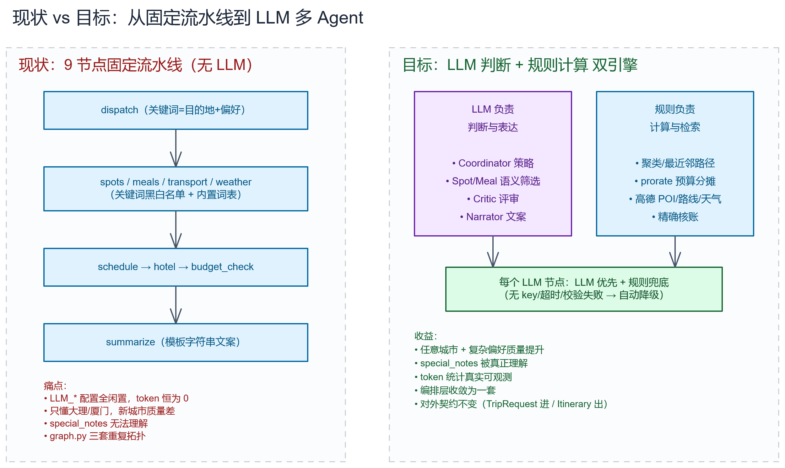
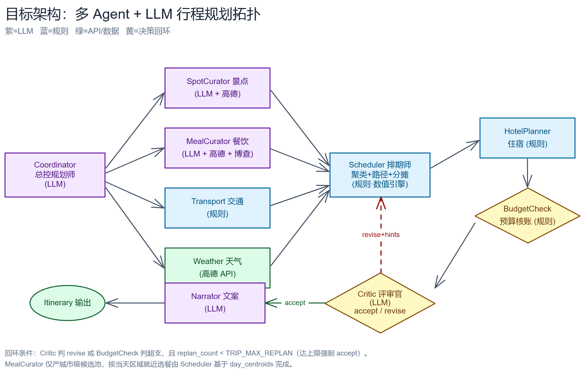
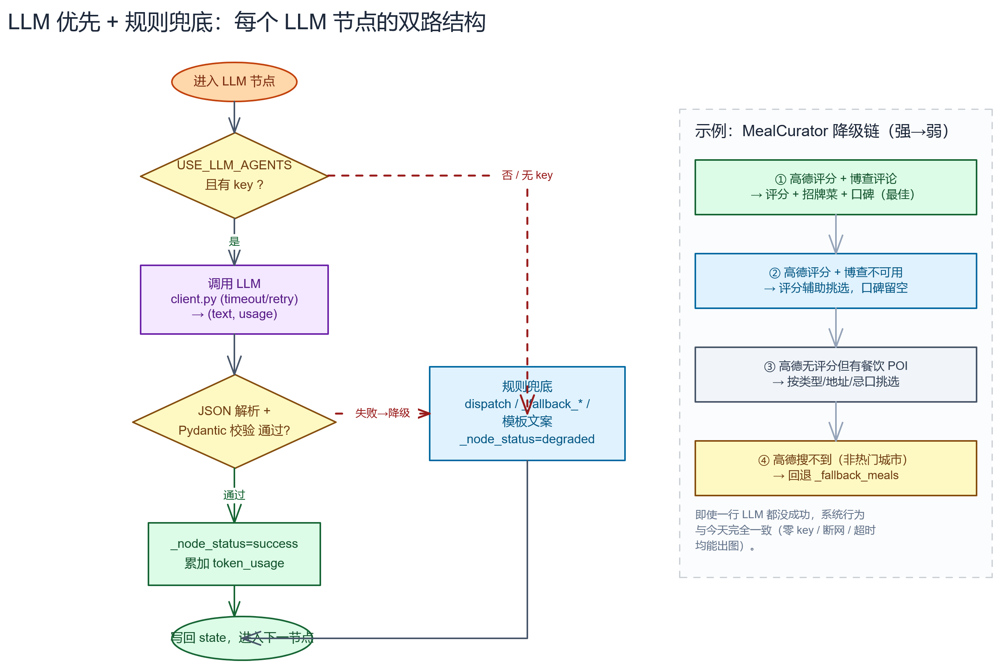
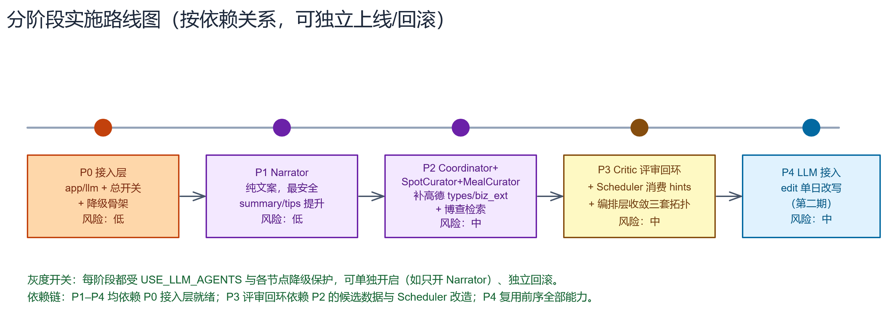

# 产品需求文档（PRD）：智旅云途 · 多 Agent + LLM 行程规划

**作者**：zhanghuizhong
**日期**：2026-06-16
**状态**：草稿（Draft）
**关联策划书**：[多Agent-LLM行程规划策划书.md](../多Agent-LLM行程规划策划书.md)
**代码范围**：`backend/app`（后端）

---

## 1. 执行摘要

把现有「9 节点固定流水线、零 LLM 调用」的伪 Agent 行程规划引擎，升级为**真正带 LLM 推理的多 Agent 协作系统**。LLM 负责需求理解、语义筛选与文案表达，规则与高德/博查 API 负责计算与事实检索；在 `USE_LLM_AGENTS` 总开关 + 逐节点降级的保护下，对外契约（`TripRequest` 进、`Itinerary` 出、SSE 流式接口）完全不变，且 LLM 不可用时自动回退到现有规则，保证零 key、断网、超时都能出结果。本期目标是显著提升非大理/厦门城市、复杂偏好、`special_notes` 特殊要求的行程质量。

---

## 2. 背景与上下文

### 2.1 现状（基于源码逐文件核实）

当前 `app/agents` 是一条 **9 节点 LangGraph 固定流水线**：

```
dispatch → (spots / meals / transport / weather 并行) → schedule → hotel → budget_check → summarize
```

其中 `budget_check → schedule` 是超预算重排回环（最多 `TRIP_MAX_REPLAN=2` 次）。关键事实：

- **没有任何一个节点调用 LLM**。`config.py` 里的 `LLM_PROVIDER / LLM_API_KEY / LLM_MODEL / LLM_BASE_URL` 全部闲置。
- 所有"智能"都是规则：景点靠关键词黑白名单过滤 + 内置 `KNOWN_DESTINATION_SPOTS`（只有大理 / 厦门），餐饮靠 `KNOWN_MEALS`，文案靠模板字符串。
- 已有工具能力（可被 LLM function calling 复用）：`search_places`、`geocode_address`、`estimate_route`、`get_weather_forecast`。
- `TokenUsage` schema 已预留 `planner_prompt_tokens / planner_completion_tokens` 字段，目前恒为 0；`monitored_node` 装饰器已留 `_tokens` 钩子——**接 LLM 的管道是现成的**。
- 技术债：`graph.py` 有三套近乎重复的拓扑（`_run_local_graph` / `stream_trip_graph_events` / `build_trip_graph`）；`trip_service.py` 重复实现了一遍 `rules.py` 的算法。

### 2.2 现状 vs 目标对比

下图对比当前「固定流水线 + 无 LLM」与目标「LLM 判断 + 规则计算双引擎」的差异：



### 2.3 设计原则：LLM 与规则的分工

| 环节 | 谁来做 | 理由 |
|------|--------|------|
| 需求理解、隐含偏好挖掘、整体策略 | **LLM** | 自然语言 `special_notes` 解析是 LLM 强项 |
| 候选景点/餐饮的语义筛选与排序 | **LLM** | "适合带老人""避免爬山"这类语义判断规则做不好 |
| 行程文案：summary / tips / 每日 theme & notes | **LLM** | 纯文本生成，LLM 碾压模板 |
| 整体合理性评审（节奏/顺路/忌口冲突） | **LLM** | 需要综合推理 |
| 地理聚类、最近邻路径排序 | **规则（算法）** | 数学优化问题，LLM 不可靠 |
| 预算分摊 `prorate_amounts`、汇总核账 | **规则** | 必须精确到分，LLM 会算错 |
| POI 检索、地理编码、路线、天气、评分/人均 | **高德 API** | 事实数据，不能让 LLM 编；评分/人均可空 |
| 招牌菜 / 口碑评论 | **博查 Web Search + LLM 提炼** | 网络检索取事实，LLM 只做摘要 |

> 一句话：**LLM 负责"判断和表达"，规则负责"计算和检索"。** 绝不让 LLM 算钱、编坐标。

---

## 3. 目标与成功指标

### 3.1 目标（Goals）

1. **接入真 LLM 多 Agent**：5 个 LLM Agent（Coordinator / SpotCurator / MealCurator / Critic / Narrator）全部可调通，非大理/厦门城市能产出有意义的差异化行程。
2. **零破坏对外契约**：`TripRequest` 进、`Itinerary` 出、`/trip/generate/stream` SSE 行为不变，前端无需改动即可运行。
3. **强降级保证**：LLM 不可用（零 key / 断网 / 超时 / JSON 校验失败）时自动回退现有规则，系统行为与今天完全一致。
4. **Token 可观测**：`/trip/stats` 能统计到真实 token（目前恒 0）。
5. **收敛技术债**：`graph.py` 三套拓扑合并为一套，消除 `trip_service.py` 重复算法。

### 3.2 非目标（Non-Goals）

1. **不改前端 UI 字段**：餐饮评分/招牌菜/口碑摘要本期合并写入 `MealItem.notes`，不单独扩展 `MealItem` schema（如需独立展示，另开一期）。
2. **不做 `edit` 单日改写**：`generate_day_edit_draft` 接入 LLM 留到 P4/第二期，本期聚焦生成主链路。
3. **不引入新的地图/餐饮数据源**：除博查 Web Search 外，复用现有高德 `map_service` / `weather_service`。
4. **不做精细化按区域餐饮精排节点**：MealCurator 只产城市级候选池，当天就近选餐仍由 Scheduler 完成。

### 3.3 成功指标

> 本产品当前为个人/演示项目，无线上用户基线，成功指标以技术质量 + 定性评估为主。

| 指标 | 当前 | 目标 | 衡量方式 |
|------|------|------|----------|
| LLM Agent 可调通率 | 0/5 | 5/5 | 各 Agent 在有 key 时返回通过 Pydantic 校验的 JSON |
| 非大理/厦门城市可生成有意义行程 | 否（仅模板） | 是 | 随机抽 5 个非内置城市人工评估行程质量 |
| 降级成功率（零 key/断网/超时） | 不适用 | 100% | 关闭 key 后仍 100% 出图，且行为与今天一致 |
| 真实 token 统计 | 恒 0 | 非 0 且与调用次数一致 | `/trip/stats` 返回值核对 |
| 行程文案质量（summary/tips） | 模板 | 人工评分明显提升 | 同一 `TripRequest` 开关 LLM 前后盲评 |
| `graph.py` 拓扑套数 | 3 | 1 | 代码评审确认单一 `PHASES` 定义 |

---

## 4. 目标用户与场景

本产品服务于**使用智旅云途生成个性化旅游行程的终端用户**，以及负责维护引擎的开发者。

- **终端用户**：输入目的地、日期、人数、预算、偏好标签、节奏、忌口、酒店档次、`special_notes` 自然语言要求，期望拿到一份顺路、合理、契合偏好的逐日行程。当前对非大理/厦门城市、复杂偏好、特殊要求几乎只能拿到模板化结果——这是本期要解决的核心痛点。
- **开发者/维护者**：需要一套可灰度、可回滚、可观测、技术债更少的引擎；本期通过总开关、逐节点降级、Prompt 集中管理、拓扑收敛来满足。

---

## 5. 用户故事与需求

### 5.1 P0 — Must Have

| # | 用户故事 | 验收标准 |
|---|----------|----------|
| P0-1 | 作为开发者，我要一个统一的 LLM 接入层，以便各 Agent 复用并在无 key 时自动降级 | 新增 `app/llm/{client,structured,registry}.py`；无 key 时 `client` 返回"不可用"信号而非抛错；`structured` 在解析/校验失败时抛 `LLMUnavailable`，节点捕获后降级；新增 `USE_LLM_AGENTS` 总开关默认 `false` |
| P0-2 | 作为用户，即使 LLM 完全不可用，我也要拿到行程 | 关闭 key 或断网后，5 个 LLM 节点全部走规则兜底，`_node_status=degraded`，最终行为与今天一致 |
| P0-3 | 作为开发者，我要 Narrator 用 LLM 生成文案 | 有 key 时 summary 60–120 字、tips 3–5 条、每日标题与提示由 LLM 生成，且过 `clean_user_tips` 过滤技术词；无 key 时回退 `summarize_node` 模板 |
| P0-4 | 作为用户，非大理/厦门城市也能拿到差异化行程 | Coordinator 输出策略+每日主题+扩展关键词；SpotCurator 调高德 `search_places(types=景点类, citylimit=true)` 得候选池后由 LLM 语义筛选；`name` 必须来自真实候选池 |
| P0-5 | 作为开发者，我要真实 token 统计 | LLM 调用 usage 累加到 `state.token_usage.planner_*`，`/trip/stats` 返回非 0 且与调用次数一致 |

### 5.2 P1 — Should Have

| # | 用户故事 | 验收标准 |
|---|----------|----------|
| P1-1 | 作为用户，我要餐饮推荐契合忌口和本地特色 | MealCurator 调高德餐饮类 `types` 候选池，LLM 按忌口+评分(可空)+特色初筛；`rating` 来自高德，缺失时输出 null 不臆造 |
| P1-2 | 作为用户，我要餐饮带招牌菜和口碑 | 博查 Web Search 增强（`BOCHA_ENABLED` 默认 false）；`signature_dishes`/`review_digest` 只能来自博查片段，无片段则留空；本期合并写入 `MealItem.notes` |
| P1-3 | 作为开发者，我要 map_service 支持类型/城市限定 | `search_places` 新增 `types`/`citylimit` 参数；解析 `biz_ext.rating/cost`；缓存 key 纳入 `types/citylimit/page_size`，避免景点/餐饮缓存互相污染 |
| P1-4 | 作为用户，我要行程被自动评审并修正 | Critic 输出 `accept/revise`，`revise` 时把 `revise_hints` 写入 `state` 回 Scheduler 重排，受 `TRIP_MAX_REPLAN` 限制达上限强制 accept |

### 5.3 P2 — Nice to Have / Future

| # | 用户故事 | 验收标准 |
|---|----------|----------|
| P2-1 | 作为开发者，我要收敛三套拓扑 | `graph.py` 抽成单一 `PHASES` 定义 + 执行器（collect/stream 两模式共享节点函数） |
| P2-2 | 作为开发者，我要消除重复算法 | 删除 `trip_service.py` 中重复的 `_prorate_amounts/_estimate_ticket_cost/_stable_bucket/_clean_user_tips`，统一 import `rules.py` |
| P2-3 | 作为用户，我要单日智能改写（第二期） | `generate_day_edit_draft` 接入 LLM 做单日改写 |
| P2-4 | 作为前端，我要独立展示评分/招牌菜字段（未来） | 显式扩展 `MealItem` schema，前端独立渲染 |

---

## 6. 解决方案概述

### 6.1 目标架构与 Agent 角色

5 个 LLM Agent + 规则/API Agent 协作，拓扑如下：



| Agent | 类型 | 职责 | 工具/依赖 |
|-------|------|------|-----------|
| **Coordinator 总控规划师** | LLM | 解析需求→输出规划策略（每日主题、节奏、预算占比建议、扩展关键词、硬性约束） | 无 |
| **SpotCurator 景点策展** | LLM+工具 | 高德取候选→语义筛选/排序/判断室内外/估时长 | `search_places(types=景点类, citylimit=true)` |
| **MealCurator 餐饮策展** | LLM+工具 | 高德评分挑选 + 博查招牌菜/口碑 + 忌口生成城市级候选池 | `search_places(types=餐饮类)` + 博查 |
| **TransportPlanner 交通** | 规则 | 按节奏出交通方案（保留现状） | — |
| **WeatherAgent 天气** | API | 高德预报 + 季节兜底（保留现状） | `get_weather_forecast` |
| **Scheduler 排期师** | 规则 | 聚类 + 路径 + 预算分摊 + 消费 `revise_hints`（核心数值引擎） | cluster/routing/rules |
| **HotelPlanner 住宿** | 规则 | 档次占比 + 权重分摊（保留现状） | rules |
| **BudgetChecker 预算核账** | 规则 | 精确汇总 + 超支判定（保留现状） | — |
| **Critic 评审官** | LLM | 审查整趟行程→`accept`/`revise`（带可执行修改理由） | `revise_hints` 状态 |
| **Narrator 文案** | LLM | 生成 summary / tips / 每日 theme & notes | 无 |

回环条件统一：`Critic 判 revise` **或** `BudgetCheck 判超支`，且 `replan_count < TRIP_MAX_REPLAN`。MealCurator 在 Scheduler 前运行时还不知每天活动中心点，因此只产**城市级候选池**，按日就近选餐由 Scheduler 基于 `day_centroids` 完成。

### 6.2 LLM 优先 + 规则兜底的双路结构

每个 LLM Agent 都是「LLM 优先 + 规则兜底」的双路结构。下图给出统一的降级流程，以及 MealCurator 从强到弱的四级降级链：



各 Agent 兜底策略：

| Agent | LLM 失败时的兜底 |
|-------|-----------------|
| Coordinator | 用现有 `dispatch_node` 逻辑（关键词=目的地+偏好） |
| SpotCurator | 用 `is_relevant_spot_place` 黑白名单过滤 + `_fallback_spots` |
| MealCurator | 高德 POI 有结果按类型/忌口/评分可空挑选 → 再不行回退 `_fallback_meals` |
| Critic | 退化为 `budget_router`（只看是否超支；Scheduler 未消费 hint 时只做只读评审） |
| Narrator | 用 `summarize_node` 的模板文案 |

> 节点状态用现有 `_node_status` 标记：LLM 成功 `success`，降级 `degraded`，机制已存在直接复用。**即使一行 LLM 都没成功，系统行为与今天完全一致。**

### 6.3 关键技术决策

- **强制 JSON 输出**：用 OpenAI 兼容的 `response_format={"type":"json_object"}` 或 function calling，返回后用 Pydantic 校验，**校验失败即降级**。
- **禁止 LLM 产出坐标/价格**：坐标来自高德 POI，价格来自 `rules.py`；LLM 选的 `name` 必须原样来自候选池。
- **高德参数校准**：`search_places` 必传 `citylimit=true`、按场景传 `types`、解析 `biz_ext.rating/cost`（可空）；缓存 key 纳入新增参数。
- **博查检索**：新增 `app/services/web_search_service.py`，走 `cache_service` 缓存；无 key/超时/失败返回空，MealCurator 跳过增强。
- **新增 LLM 接入层** `app/llm/`：`client.py`（统一客户端，单例懒加载，无 key 不抛错）、`structured.py`（JSON 调用+Pydantic 校验）、`registry.py`（Prompt 集中管理，可版本化）。

### 6.4 对外契约影响

- `TripRequest` / `Itinerary` schema：**不变**。
- `/trip/generate`、`/trip/generate/stream`、`/trip/edit`：**接口签名不变**。
- SSE 事件：可**新增** coordinator/critic/narrator 节点事件，前端不处理也不影响——向后兼容。
- 餐饮评分/招牌菜/口碑：不改 schema，合并写入 `MealItem.notes`。

---

## 7. 待解决问题

| 问题 | 负责人 | 截止 |
|------|--------|------|
| LLM_PROVIDER 实际选型与 `LLM_BASE_URL` 是否走代理，需确认可用的 OpenAI 兼容端点 | zhanghuizhong | P0 启动前 |
| 博查 API 的实际配额与计费，是否值得默认开启 `BOCHA_ENABLED` | 待定 | P2 启动前 |
| 高德餐饮/景点 `types` 类型码的精确取值（如 050000/110000 之外是否需扩展） | 待定 | P2 调试期 |
| Critic 回环对延迟的影响是否可接受，是否需要为 Critic 单独设更小的超时 | 待定 | P3 |
| 评审/盲评的人工评分标准与样本城市清单 | zhanghuizhong | P1 验收前 |

---

## 8. 时间线与分阶段（按依赖关系）

下图给出 P0→P4 的阶段依赖与灰度/回滚边界：



| 阶段 | 内容 | 产出 | 依赖 | 风险 |
|------|------|------|------|------|
| **P0** | 搭 `app/llm` 接入层 + 总开关 + 降级骨架 | 能调通 LLM、无 key 自动降级 | — | 低 |
| **P1** | Narrator（纯文案，最安全，不影响结构） | summary/tips 质量肉眼可见提升 | P0 | 低 |
| **P2** | Coordinator + SpotCurator + MealCurator（先补高德 `types/citylimit/biz_ext`，再接博查） | 非大理/厦门城市行程质量提升 | P0 | 中 |
| **P3** | Critic 评审回环 + Scheduler 消费 `revise_hints` + 编排层收敛三套拓扑 | 行程合理性自检 + 还技术债 | P2 | 中 |
| **P4** | LLM 接入 `edit` 单日改写（第二期） | 编辑功能真正智能 | P0–P3 | 中 |

每阶段都可独立上线、独立回滚（靠 `USE_LLM_AGENTS` 和各节点降级）。**灰度策略**：可只开 Narrator 先验证文案，再逐步开启其他 Agent。

### 8.1 新增配置项汇总

```bash
# LLM 多 Agent 总开关
USE_LLM_AGENTS=false

# 博查 Web Search（餐饮评论/菜品增强）
BOCHA_ENABLED=false
BOCHA_API_KEY=
BOCHA_BASE_URL=https://api.bochaai.com/v1
BOCHA_TIMEOUT_SECONDS=15
```

> 现有 `LLM_*`、`AMAP_*`、`REDIS_*` 配置全部复用，无需改动。

---

## 附录：主要风险与对策

1. **LLM 编造景点/价格** → 强约束 prompt + 输出后校验 `name` 必须来自候选池 + 价格坐标走规则/高德。
2. **LLM 编造菜品/评论** → `signature_dishes`/`review_digest` 只能来自博查检索片段，无片段则留空。
3. **JSON 解析失败** → 结构化输出 + Pydantic 校验 + 失败即降级，不影响出图。
4. **高德宽关键词噪声大** → `search_places` 必传 `citylimit=true`，景点/餐饮分别传 `types`，保留黑白名单过滤。
5. **高德评分/人均缺失** → `rating/avg_cost` 按可空处理；无评分时不降级，只降低排序权重。
6. **缓存污染** → 地图缓存 key 纳入 `types/citylimit/extensions/page_size`。
7. **MealCurator 不知当天位置** → 只产城市级候选池，按日就近选餐由 Scheduler 完成。
8. **Critic 回环空转** → `revise_hints` 必须写入 `state` 并被 Scheduler 消费；否则只允许只读评审。
9. **延迟/成本上升** → 并行调用 + 缓存 + 总开关灰度 + 可只开 Narrator。
10. **回环死循环** → 沿用 `TRIP_MAX_REPLAN` 上限，达上限强制 accept。
11. **prompt 漂移** → prompt 集中在 `registry.py`，可版本化、可 A/B。

> 数据来源：博查 Web Search API（`POST https://api.bochaai.com/v1/web-search`，详见 [博查 AI 开放平台](https://open.bochaai.com/)）；高德地图 POI/天气/路线复用现有 `map_service.py` / `weather_service.py`。
